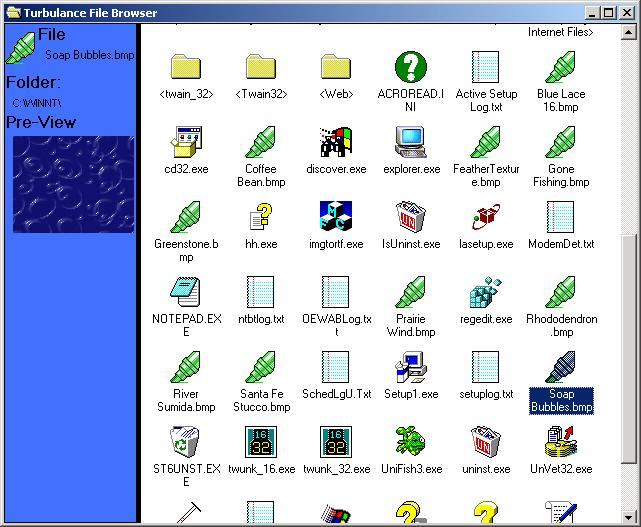



## My Computer type File Browser

### Description

A VB clone of Windows My Computer, A file browser that shows the files Icon, or and icon of what type it is, It shows you how you can have a file directory in a image list, rather than the built in boring one.
 
### More Info
 
'Some times if you goto the drives and click on the one you came from it may not work, and if you change the background colour of the imagelist then change the background colour of prog picture box to

             |
---                |---
**Submitted On**   |2000-10-01 19:00:30
**By**             |[N/A](https://github.com/Planet-Source-Code/PSCIndex/blob/master/ByAuthor/empty.md)
**Level**          |Intermediate
**User Rating**    |4.5 (18 globes from 4 users)
**Compatibility**  |VB 6\.0
**Category**       |[Files/ File Controls/ Input/ Output](https://github.com/Planet-Source-Code/PSCIndex/blob/master/ByCategory/files-file-controls-input-output__1-3.md)
**World**          |[Visual Basic](https://github.com/Planet-Source-Code/PSCIndex/blob/master/ByWorld/visual-basic.md)
**Archive File**   |[CODE\_UPLOAD103321012000\.zip](https://github.com/Planet-Source-Code/my-computer-type-file-browser__1-11810/archive/master.zip)

